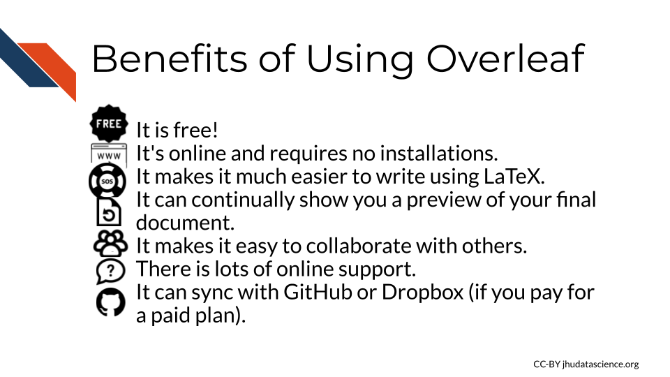
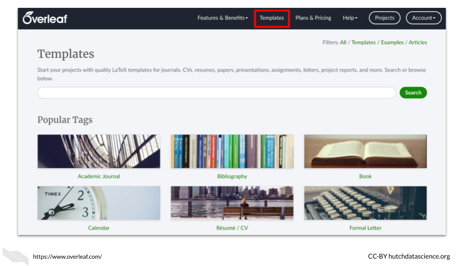
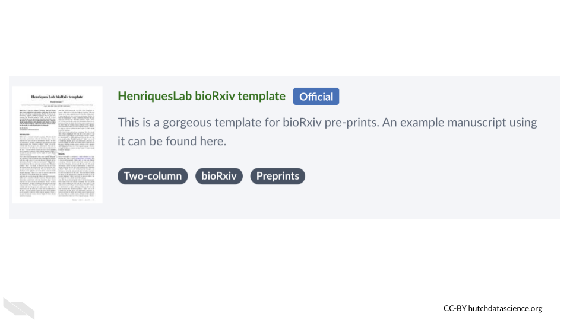
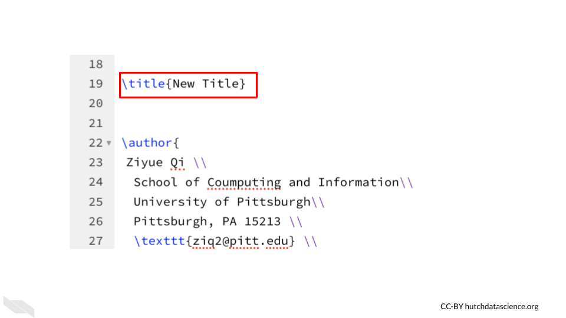

# Overleaf

Overleaf is a free online LaTeX editor, meaning it helps you write text using LaTeX to determine how your document will look.  In this chapter we will introduce you to Overleaf and get you set up to create a document.

Since LaTeX can be pretty tricky, Overleaf can be super helpful!

 
As a LaTeX editor, Overleaf shows you what the result of your LaTeX tags will be, suggests possible LaTeX tags, and provides you with helpful guidance. We will learn more about each of these in this overview.

## Benefits of Overleaf

There are other LaTeX editors, but Overleaf is a really nice option for a number of reasons:
 
1) It is free! 
1) It's online and requires no installations.
1) It makes it much easier to write using LaTeX.
1) It can continually show you a preview of your final document.
1) It makes it easy to collaborate with others.
1) There is lots of online support.
1) It can sync with GitHub or Dropbox (if you pay for a paid plan).

## Getting Started

To start, you need to make an account on Overleaf.

To do so, you can go to https://www.overleaf.com/register in your browser.

There are several ways to register:

1. Register with an IEEE account
1. Register with your Google account
1. Register with your ORCID account
1. Register with a different email address
1. Log in with an institution.
    This is worth checking in case your university has a license, as this may provide you with more features. 
    
The free version only allows you to have one collaborator on a project, so collaboration is more limited. However, you can still benefit from many of the other features.  Note that students can receive a discount as well.

If possible, it may be worth seeing if your institute would get an organizational license.

## Working with Templates

Overleaf is organized with projects. When you create a project, you can start from scratch or start from a template.

Let's start with a template to help us better understand the features of Overleaf. We can search through all the templates by clicking on "View All" button of the project menu.  We can also click on the "templates" tab to get to the same template search page.  

You can see that there are many templates to choose from! There are templates for writing a letter, writing a thesis, writing a CV, writing a book and more. 

Tip! - If you need to write a thesis or you have a student that needs to write one, check to see if your university or department has a LaTeX template that you can use to help everyone save time on formatting and spend more time writing the content.

Let's search for a term, such as "preprint" to see if the templates for preprints. 

You will see that a few of the templates have a blue "official" tag. This is the best option if you find one for the publisher that you are interested in.

We will use a template for arXiv. 

You can go to this [link](https://www.overleaf.com/latex/templates/style-and-template-for-preprints-arxiv-bio-arxiv/pkzcrhzcdxmc){target="_blank"} to start with the same particular template to create a manuscript for [arXiv](https://arxiv.org/).

Click the "Open as Template" button to get started. 

 
## Viewing documents

Now that we have opened a template, we will start by understanding how we can view our work on Overleaf.

Overleaf easily shows you what the rendered version of your text will look like, taking into account the LaTeX tags that indicate how the text should be arranged and styled. The default view is to see the raw text (aka source text) on the left and the rendered/compiled version on the right. 

You can also change the view to several other options:

If you are using the default view and you want to see what the file looks like in the rendered form for the same location as that of the source text of the editor, you can click on the arrow (with the arrowhead facing to the right) in between.

To do the opposite and go to the location in the source text where you are currently viewing in the rendered text, click the arrow button facing the source text editor.

If you make a change in the source and want to see how it changes the look of the file, you need to press the "Recompile" button. 

It is a good idea to press the "Recompile" button frequently, so that you can identify any errors more easily. If you wait too long to check, then you will have more new changes to look through to try to understand the error.

## Making changes

Now let's try a simple change to start getting used to writing with LaTeX. 

First we will change the title, which is currently "Predict future sale". We can search the source editor text by clicking on the editor pane and using the search and find keyboard shortcut (control and the F key). If we type "Predict future sale" in the text box, we find it on line 19 following `\title`.

We can now replace the text with our own title. Be careful to make sure that the brackets are closed around the replacement text. Here we replace it with "New Title."

Now we can click the "Recompile button" to see the results.

After overleaf has finished compiling, you can see that the title has been changed.

Congratulations! You just made your first edit in Overleaf.
In the next chapter, we will take a deeper dive into editing documents.

## Conclusion

We hope that this chapter has given you some more knowledge about what Overleaf is and how it can help you write documents, as well as the benefits of using it.

Here are some of the major take-home messages:

1. Overleaf is a collaborative LaTeX editor, that helps you write documents using LaTeX.
2. Benefits of Overleaf include: it's free (although you can pay for more features), it's online and requires no installations, it shows you a preview of how your document will look, it makes it easier to collaborate with others.
3. To use Overleaf you need to make an account first, which takes just a few minutes.
4. There are many templates that you can use to write many different types of documents, including journal articles, CVs, graphics, and more!
5. Some journals have even vetted templates to be their official template, look for the blue "official" tag.
6. It's a good idea to keep pressing the "recompile" button often as you make changes so that you can more easily see what might be causing an error if something goes wrong.
