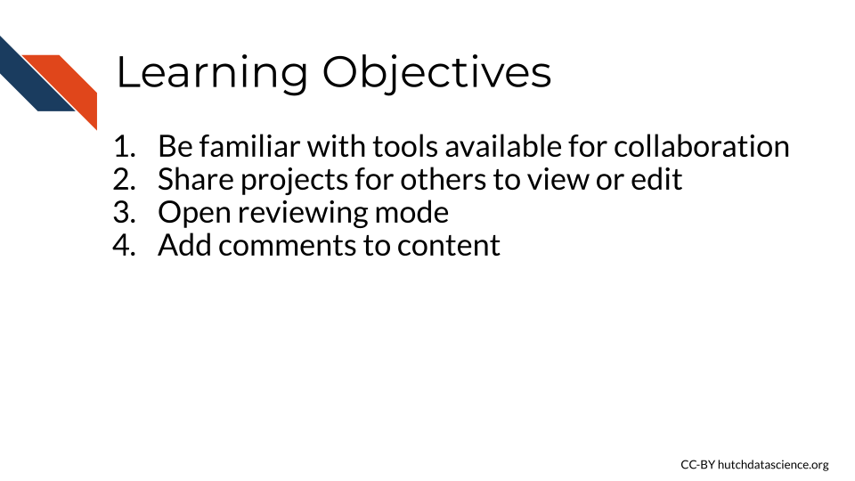
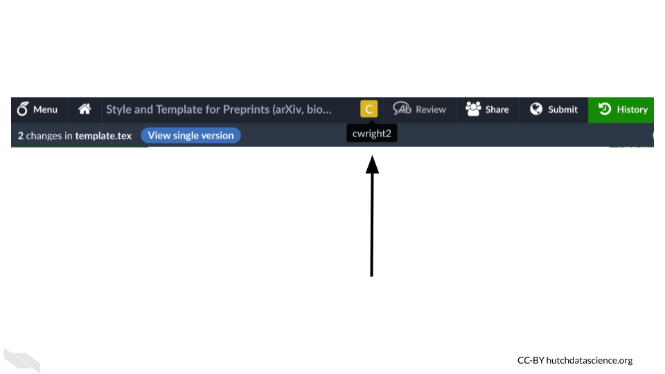
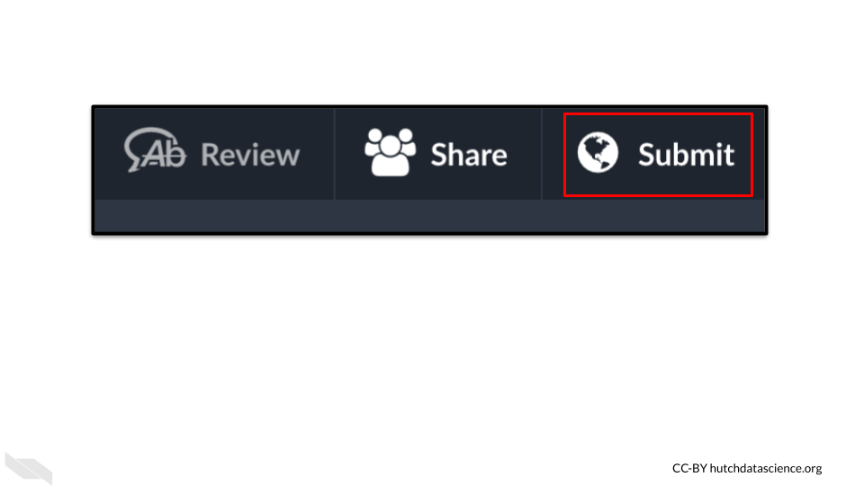

# Collaborating

Collaborating on Overleaf is much more doable if you have access to a [paid plan](https://www.overleaf.com/user/subscription/plans). If you have a collaborator who has a paid plan, then you will have access to the features that are part of their plan. 

## Learning Objectives

## Seeing collaborators

Different users will show up as a square with the first initial of their username if collaborators are also working on the same file. 

https://docs.google.com/presentation/d/1UgGtVn7RsqdQ4pJxDk_dueSyREHcH-uWTNAT27E2mG8/edit#slide=id.g1c917691280_100_19

## Sharing

You can share a project with a collaborator or really the world similarly to a Google document by clicking on the share button and specifying how you want people to access your project.

## Submitting

When you are ready to submit a document to a publisher, like a preprint to arXiv, you can do so using the  `submit` button.

## Messages

You can send general messages using the "Chat" button.

## Review mode

If you press the "review" button, which is to the right of the "share" button, you can enable certain reviewing features.

You will see a gray column open to the right of the source editor. Here you can add comments and toggle on and off the tracking of changes.

### Adding comments

You can also write comments about specific text by highlighting the text in review mode (by first pressing the review button) and then clicking "add comment".

Comments need to be verified to be posted. They can then be edited, resolved, or responded to.

Resolved comments can be found at the top left button in the review panel when in review mode.

## Conclusion

We hope that this chapter has given you some guidance about how to collaborate with others on Overleaf.

Here are some of the major take-home messages:

1. Collaboration is more possible with a paid plan. If you collaborate with someone on a paid plan, you will also have access to collaboration features when working on that project.
1. When collaborators are actively working on a project you will see an icon at the top menu as a colored square with a letter in it.
1. You can share projects similarly to Google Docs meaning that you can specify if a particular person has access or if anyone with a link can either just read or edit a project.
1. You can actually submit manuscripts directly to some journals, as well as preprints to arXiv by using the submit button. 
1. You can send general messages to collaborators using the Chat button.
1. In review mode, which is activate when you press the Review button, you will see a panel that allows you to write and see comments, as well as turn on or of the tracking of changes.
1. Comments can be made by highlighting code in review mode and then clicking "add comment". After you write a comment you need to click the "Comment" button.
1. Comments can be edited, resolved, or replied to.

