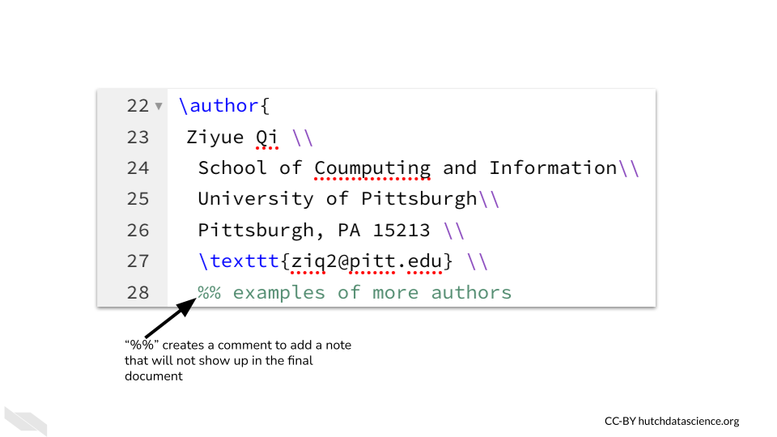
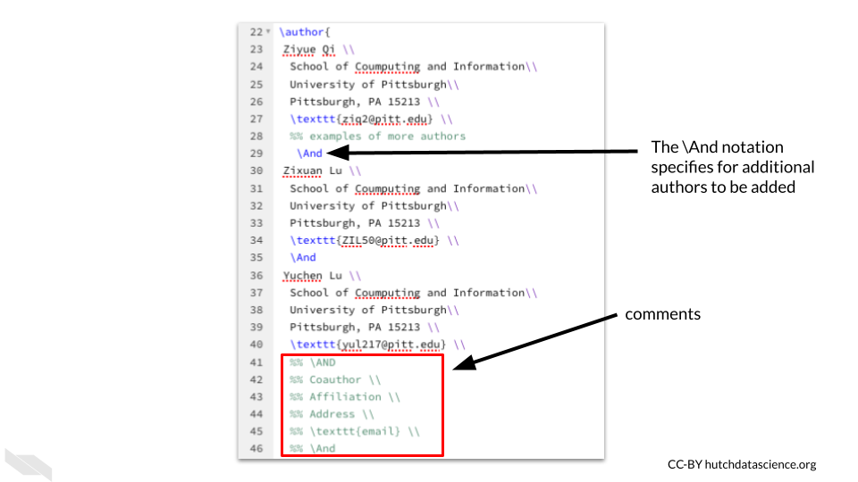
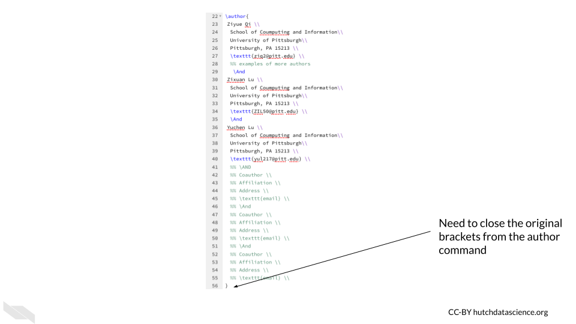
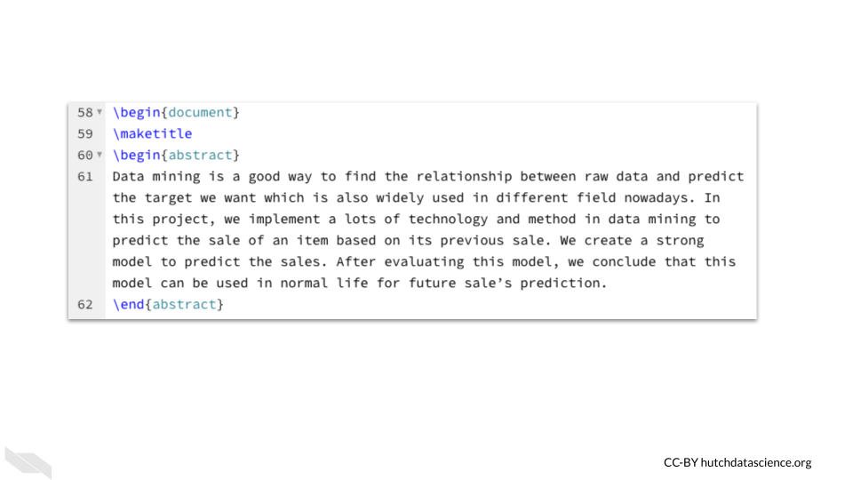

# Writing with Overleaf

Now that you know the advantages of using overleaf and have started working with a template, we will now discuss more about how to make additional modifications to your document.

## LaTeX Basics

Since we are working with a template, it isn't necessary to learn everything there is to know about writing in LaTeX to get started. However, it can be useful to understand some fundamentals, so we will go over most of the commands that you see listed in the template.

### Document Class 

At the top of the template you will notice `\ducumentclass{article}`.

This specifies general typesetting information about the type of document that we intend to make. For example, it often specifies font size, the overall layout of the text, and alignment of various features of the text. Since we are writing a scientific article, the specification here is `article`.

To learn more about document classes see this [documentation link](https://libguides.utsa.edu/c.php?g=522165&p=3570198) form @wu_libguides.

### Packages

Next you will see that  `\usepackage{}` is repeated several times with different information in the brackets:

We will refer to these tags with brackets such as `\usepackage{}` as **commands** from now on (as this is what the are generally referred to) and they cause a change to either the text within the brackets or the overall document.

The next commands install some packages. Packages are additional code to help you do additional things with your documents. If a command comes from a specific package, you will need to install the package that it comes from first. Commands from these packages will be utilized later in the template. It is recommended that you leave this code as is, and only modify the rest of the template until you learn more. 

In addition to determining what commands you can use, packages will also determine how the content is formatted or laid out.

### Author section

You may recall that we previously described how to bold font using `\textbf{bold text}`.
With LaTeX you will be using brackets often to designate what to do with a specific set of text that is contained within the brackets.

If you do not close a set of brackets you will get an error, so be careful about this.

Next, we see the `\title` command that we previously worked with, as we already modified the text within the brackets to change the title. 

Then we see the `\author` command to add authors to the paper. These will be formatted in the way that is shown on the template. When you see `\\` two backslashes, this indicates that the line is finished and a new one is to be made. It is best to  [avoid](https://tex.stackexchange.com/questions/225893/what-does-double-backslash-in-latex-mean)  using this for line breaks within the paragraphs that you might include in the paper, but for tables or formatting like the authors, it should work well.

We also see another command `\textttt{}` used within the `\author{}` command to change the text to typewriter font.

You may also notice `%% examples of other authors` is in green and does not show up in the rendered document. This is what is called a **comment** and it can be used to write notes about the material.

In the author section, the `\And` allows for additional authors to be added and needs to be used between each other. 

Finally, the author section needs to be completed by closing the brackets.

### Beginning Commands 

The next command `\begin{document}` enables us to format text for the body of the article. If you put `%%` in front of the command to change it to a comment and therefore not use the command, you will see that the document is formatted overall slightly differently. It will be paired with `\end{document}` that you will see at the bottom of the template if you scroll down.

The `\maketitle` will add the title the page where the `begin{document}` command was used. Otherwise, if you used it before `begin{document}`, the title and authors will show up on a separate page first. You can test moving this command around to see how the document changes.

### Abstract

The abstract section can be distinguished using the `begin{}` and `end{}` functions just like we used for the body of the document. These two commands will be used later as well to indicate that a specific part of the document has started or ended.

### Section commands:

- `\section{section name}` - This will help you to create sections in our template. We don't need to do anything to modify the text, it will automatically bold the text and number the sections (1, 2, 3 etc.).

- `\subsection{subsubsection name}` - This will help you to create subsections, these headings will be one level down from the section headings and will be numbered like 1.1, 1.2. 

- `\subsubsection{subsubsection name}` - This will help you to create sections one level down from subsections, these heading will be numbered like 1.1.1, 1.1.2.

In the template you can see how these are formatted:

The `\paragraph{}` command works similarly, but it will not be numbered. The text within the brackets is an optional word that is bold to start the paragraph. You can also leave it empty. However, you can specify if you want sections to be not be numbered as well when using an asterisks `*` between the command name and the brackets `section*{}`.

### Dummy text

You may notice that `\lipsum[]` is used to create random chunks of text. The number within the brackets indicates how what specific dummy paragraph to use out of 150.

### Equations

It can be very helpful to include a mathematical equation. To do so we need to use our handy `\begin{equation}` and `\end{equation}` functions to indicate the boundaries. Using `equation` within the brackets indicates that this should be formatted in a certain way. It will center the text nicely and number it.

For more information about mathematical expressions in overleaf see the [Overleaf documentation](https://www.overleaf.com/learn/latex/Mathematical_expressions).

